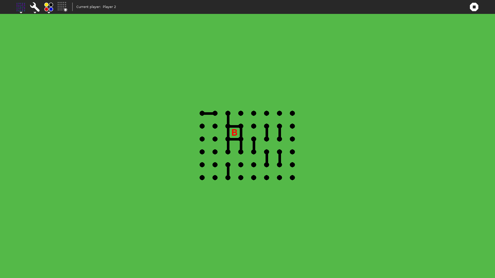

# dotsAndBoxes

A sugar game about the classic Dot and boxes

## How to Use?

dotsAndBoxes is not integrated into the Sugar desktop by default but can be added. Please follow these steps:

- [Get Sugar on sugarlabs.org](https://sugarlabs.org/)
- [Learn how to use Sugar](https://help.sugarlabs.org/)

## How to Upgrade?

For Sugar desktop systems:

- Use [My Settings](https://help.sugarlabs.org/my_settings.html), [Software Update](https://help.sugarlabs.org/my_settings.html#software-update).

## Reporting Bugs

To report bugs or suggest improvements, please visit the [issues tab](https://github.com/sugarlabs/dotsAndBoxes/issues) of this repository.

## Contributing

We welcome contributions to dotsAndBoxes! Please read our [contribution guidelines](https://github.com/sugarlabs/sugar-docs/blob/master/src/contributing.md) to get started.
